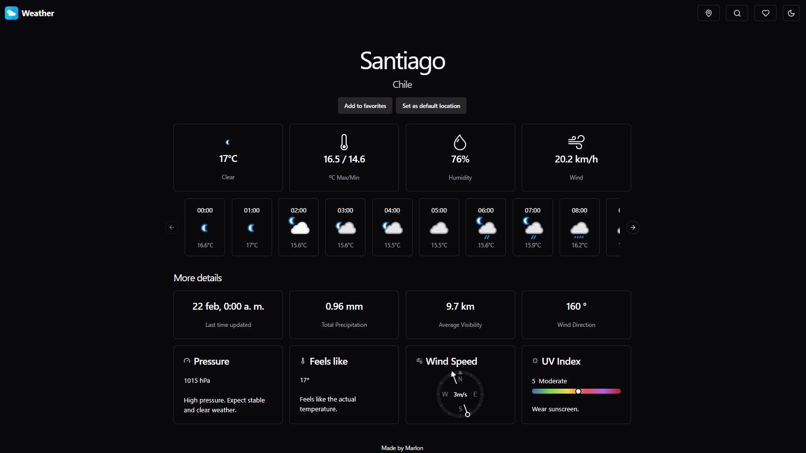

# Weather: Weather Forecast App

Weather is a weather forecast application designed with Next.js, leveraging the powerful WeatherAPI to provide accurate and up-to-date forecasts. The user-friendly and responsive interface makes it easy for users to get the weather information they need with just a few clicks.



## Features

- **Daily and Weekly Weather Forecasts**: Get the latest weather forecasts, including details like temperature, precipitation, humidity, and more.
- **Location-based Search**: Search for the weather forecast by city, postal code, or geographic coordinates.
- **Responsive Interface**: Designed to adapt to any device, allowing users to access the weather forecast from anywhere.
- **Integration with WeatherAPI**: Utilizes WeatherAPI to fetch accurate and real-time weather data.

## Technologies Used

- [Next.js](https://nextjs.org/)
- [TypeScript](https://www.typescriptlang.org/)
- [Tailwind CSS](https://tailwindcss.com/) o [Shadcn](https://ui.shadcn.com/)
- [WeatherAPI](https://rapidapi.com/weatherapi/api/weatherapi-com)

## Installation

Para ejecutar Weather en tu entorno local, sigue estos pasos:

```sh
git clone https://github.com/marlon12796/open-weather
cd weather
npm install
```
